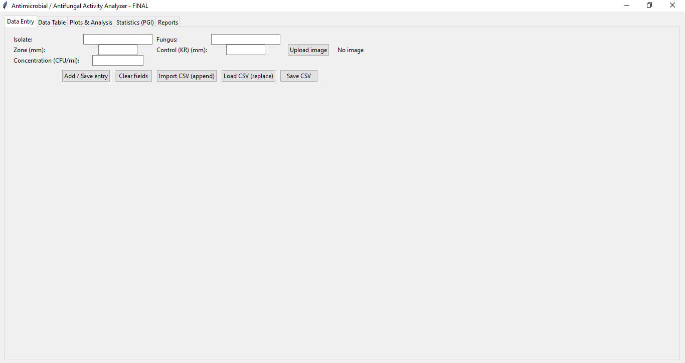

📌 Antimicrobial Analyzer – Halophilic Bacteria vs Phytopathogenic Fungi

A research tool for antifungal activity analysis and PGI% computation

-----------------------------------------------------------------------------------------------------------------------------------------------------

👨‍🔬 Developed by: Ali Dahou

🧪 Hi, I’m Ali Dahou — a microbiologist, data enthusiast, and aspiring scientific-software developer from Algeria.

  My work blends laboratory science with modern data analysis and app development, focusing on building practical tools that help researchers work faster and more accurately. I’m passionate about transforming real experimental workflows into clean, intuitive digital applications.
  
🔬 Scientific Background

  PhD candidate researching halophilic bacteria from hypersaline ecosystems
  Special interest in antifungal activity, biological control, and environmental microbiology
  Strong experience in blood bank microbiology and practical laboratory protocols
  
💻 Development Interests

  Scientific software
  Data visualization & reproducible analysis
  Bioinformatics tools
  R/Shiny apps
  Automation of lab workflows
  
🎯 Mission

  To bridge the gap between microbiology and software engineering by creating tools that make research more efficient, transparent, and accessible.

  -----------------------------------------------------------------------------------------------------------------------------------------------------

🚀 Overview

This application allows researchers to:

Record inhibition zone measurements (mm)

Compare multiple halophilic bacterial isolates against several fungi species

Calculate Percentage Growth Inhibition (PGI%) using the formula:

PGI=(𝐾𝑅−𝑅1)/𝐾𝑅×100

where:
KR → Average radial growth (mm) of the fungus in the control plate

R1 → Average radial growth (mm) in the treated plate

-----------------------------------------------------------------------------------------------------------------------------------------------------

🔬 Main Features

1. Data Entry

✔ Add, edit, delete antifungal test records

✔ Upload CSV files

✔ Supports:

Fungus species

Bacterial isolate

Inhibition zone (mm)

Control values

Bacterial concentration (UFC/mL)

2. Plot & Analysis

✔ Compare isolates against the same fungus

✔ Compare fungi resistance levels

✔ Show:

Histograms

Scatter plots with isolate labels

Line plots

  ✔ Identify the most resistant fungus
  
  ✔ Identify the most effective isolate

3. PGI% Statistics

✔ Automatic PGI% calculation for each isolate/fungus pair

✔ Grouped bar charts similar to scientific publications

✔ Formula visibly displayed

✔ Exportable summary PDF

4. PDF Generation

✔ Professional report with:

Dataset summary

Charts

PGI tables

  ✔ Ready for publication or thesis use

-----------------------------------------------------------------------------------------------------------------------------------------------------

📁 Project Files

| File                               | Description                          |
| ---------------------------------- | ------------------------------------ |
| `app.py`                           | Main Streamlit application           |
| `requirements.txt`                 | Python dependencies                  |
| `example_dataset_with_control.csv` | Demo dataset                         |
| `LICENSE`                          | Open-source license (MIT by default) |

🛠 Installation

git clone https://github.com/yourusername/Antimicrobial-Analyzer.git

cd Antimicrobial-Analyzer

pip install -r requirements.txt

streamlit run app.py

-----------------------------------------------------------------------------------------------------------------------------------------------------

🖼 Screenshots

### 🧪 Data Entry Interface

### 📈 PGI Statistics

-----------------------------------------------------------------------------------------------------------------------------------------------------

📜 License

Distributed under the MIT License.

